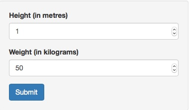
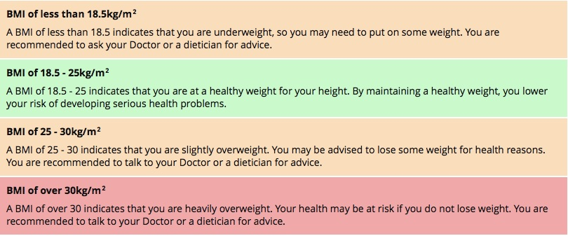

## Application Overview

Healthcare professionals around the world often use **Body Mass Index (BMI)** when determining whether patients are underweight, healthy weight, overweight or clinically obese. People who are clinically obese have a greater risk of developing diabetes, stroke, some cancer, and cardiovascular diseases.

The App calculates a person's BMI based on his / her Height & Weight.  While BMI can be calculated in *Metric* or *Imperial* scale, the App currently supports Metric scale only.

---

## Using the App

To use the App, please go to [BMI Calculator](https://sri12ram.shinyapps.io/bmiCalculation).
Height and Weight can be input in the textboxes on the left side of the page.  The number can be directly typed in the textbox or the arrows used to increase / decrease.  

Here are the steps...  
1. Input your Height (in Metres) and Input Weight (in Kilograms)  
2. Then, click on the **Submit** button  
3. Your BMI prediction is shown on the left side of the page  



---

## How it Calculates BMI

The formula for BMI is

$$\frac{weight}{height^2}$$

So to calculate the BMI of a person whose Height is 5 feet 10 inches (1.778 metres) and Weight is 200 pounds (90.7185 kilograms),  we can use the web application and run the following.

```{r}
90.7185 / (1.778 * 1.778)
```

It's quite easy to work out that the BMI is 28.69.  We can then check this against the chart given in the next page to see where we fit.

---

## Reference 



Thanks for using the BMI Calculation App.  Hope it is helpful.

**References:**
* [Wikipedia page for BMI](http://en.wikipedia.org/wiki/Body_mass_index)
* [Medical News Today](http://www.medicalnewstoday.com/info/obesity/what-is-bmi.php)
